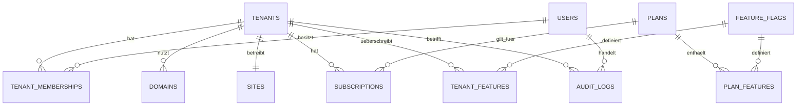

# Datenbankschema und Mandantentrennung

Stand: Phase 3. Das code-first Schema liegt in `src/db/schema.ts`; versionierte SQL-Migrationen liegen unter `drizzle/`.



## Tabellen

- `tenants`: Fahrschulen mit stabilem UUID-Bezeichner, Slug und deaktivierbarem Status.
- `users`: Plattformweite Identitäten; Plattformrolle und Tenant-Mitgliedschaften bleiben getrennt.
- `tenant_memberships`: aktive Rolle eines Benutzers innerhalb genau eines Mandanten.
- `domains`: normalisierte, global eindeutige Hostnamen und Onboarding-/SSL-Status.
- `sites`: mandantengebundene Website-Grundeinstellungen.
- `plans`, `subscriptions`: vorbereitete Tarifzuordnung ohne Zahlungsabwicklung.
- `feature_flags`, `plan_features`, `tenant_features`: zentrale Features, Planstandard und Mandanten-Override.
- `audit_logs`: append-orientierte sicherheitsrelevante Ereignisse; mandantenübergreifende Plattformereignisse dürfen `tenant_id = NULL` verwenden.

## Isolationsregel

Jede fachliche Tabelle mit Mandantendaten erhält `tenant_id`. Serverseitige Dienste bekommen einen geprüften `TenantContext`; eine ID aus Request, URL oder Formular erzeugt allein keinen Kontext. Objektzugriffe müssen `tenant_id` in derselben Abfrage einschränken. Die Datenbank ist eine zusätzliche Persistenzgrenze, ersetzt aber keine Autorisierung.

Cross-Tenant-Tests prüfen ab Phase 3, dass Mitgliedschaften und Objekte anderer Mandanten abgewiesen werden. Künftige Medien, Inhalte, Anfragen, Cache-Schlüssel und Jobs folgen derselben Regel.

## Migrationen und lokaler Seed

```bash
pnpm db:generate
pnpm db:check
pnpm db:migrate
pnpm db:seed
```

`db:migrate` und `db:seed` benötigen eine erreichbare lokale MySQL-/MariaDB-Datenbank aus `DATABASE_URL`. Der Seed ist idempotent und verwendet ausschließlich fiktive `.local`-Identitäten. Die Demo-Benutzer besitzen bis Phase 4 bewusst kein Passwort und sind noch nicht anmeldbar.

Eine lokale Datenbank war in der Codex-Umgebung nicht verfügbar. Migration und Seed sind reproduzierbar implementiert; die tatsächliche Anwendung gegen MySQL/MariaDB bleibt als dokumentierte lokale Prüfung offen.
