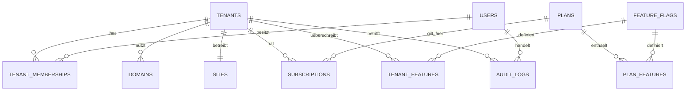

# Datenbankschema und Mandantentrennung

Stand: Phase 3. Das code-first Schema liegt in `src/db/schema.ts`; versionierte SQL-Migrationen liegen unter `drizzle/`.



## Tabellen

- `tenants`: Fahrschulen mit stabilem UUID-Bezeichner, Slug und deaktivierbarem Status.
- `users`: Plattformweite Identitäten; Plattformrolle und Tenant-Mitgliedschaften bleiben getrennt.
- `platform_settings`: Anbieter-, Kontakt-, Design- und Wartungsstatus der zentralen FahrSeiten-Plattform.
- `tenant_onboarding_tokens`: nur als Hash gespeicherte, ablaufende und einmal verwendbare Einrichtungslinks für neue Mandanten.
- `sessions`, `password_reset_tokens`, `auth_rate_limits`: gehashte Authentifizierungstokens, Ablauf und vorbereitete persistente Drosselung.
- `tenant_memberships`: aktive Rolle eines Benutzers innerhalb genau eines Mandanten.
- `domains`: normalisierte, global eindeutige Hostnamen und Onboarding-/SSL-Status.
- `sites`: mandantengebundene Website-Grundeinstellungen einschließlich Wartungsstatus und Vorschautext.
- `plans`, `subscriptions`: vorbereitete Tarifzuordnung ohne Zahlungsabwicklung.
- `feature_flags`, `plan_features`, `tenant_features`: zentrale Features, Planstandard und Mandanten-Override.
- `audit_logs`: append-orientierte sicherheitsrelevante Ereignisse; mandantenübergreifende Plattformereignisse dürfen `tenant_id = NULL` verwenden.

## Isolationsregel

Jede fachliche Tabelle mit Mandantendaten erhält `tenant_id`. Serverseitige Dienste bekommen einen geprüften `TenantContext`; eine ID aus Request, URL oder Formular erzeugt allein keinen Kontext. Objektzugriffe müssen `tenant_id` in derselben Abfrage einschränken. Die Datenbank ist eine zusätzliche Persistenzgrenze, ersetzt aber keine Autorisierung.

Cross-Tenant-Tests prüfen ab Phase 3, dass Mitgliedschaften und Objekte anderer Mandanten abgewiesen werden. Künftige Medien, Inhalte, Anfragen, Cache-Schlüssel und Jobs folgen derselben Regel.

## Migrationen und lokaler Seed

```bash
pnpm db:generate
pnpm db:check
pnpm db:migrate
pnpm db:seed
pnpm db:schema:bundle
```

`db:migrate` und `db:seed` benötigen eine erreichbare lokale MySQL-/MariaDB-Datenbank aus `DATABASE_URL`. Der Seed ist idempotent, ausschließlich für lokale Entwicklung bestimmt und verwendet nur fiktive `.local`-Identitäten. Er darf nicht auf Staging oder Produktion ausgeführt werden.

`db:schema:bundle` erzeugt `dist/sql/fahrseiten-schema.sql` aus sämtlichen versionierten Migrationen. Die Datei ist ausschließlich für eine neue, leere Datenbank bestimmt und schreibt auch den Drizzle-Migrationsstand. Für bestehende Datenbanken werden immer die Migrationen verwendet. Der Produktionsinstaller führt dieselbe Migrationskette aus und erzeugt keine Demo-Daten.

Eine lokale Datenbank war in der Codex-Umgebung nicht verfügbar. Migration und Seed sind reproduzierbar implementiert; die tatsächliche Anwendung gegen MySQL/MariaDB bleibt als dokumentierte lokale Prüfung offen.

## Installation und spätere Mandanten

Es gibt genau eine zentrale FahrSeiten-Installation mit einer gemeinsamen Datenbank. Der geschützte Webinstaller unter `/setup` wendet die Migrationen an und legt einmalig den ersten `platform_owner` sowie die Anbieter- und Designstammdaten an. Sein Installationscode kommt ausschließlich aus der Serverumgebung und wird nach erfolgreichem Abschluss entfernt. Der Shell-Installer bleibt als Alternative verfügbar.

Eine Fahrschule wird anschließend über einen vom Plattform-Owner erzeugten Einmal-Link als Tenant provisioniert. Die Transaktion legt Mandant, `tenant_owner`, Mitgliedschaft, Site, Theme, Hauptstandort, Kontaktformular, Startseite, Navigation, Domain im Status `pending` und Audit-Eintrag an. Der Link ist sieben Tage gültig, wird in der Datenbank nur gehasht gespeichert und nach Verwendung gesperrt. Dafür wird weder das Schema erneut importiert noch eine weitere Anwendungskopie angelegt. Tarif, Rechtstexte und Domainfreigabe bleiben bewusst außerhalb dieses initialen Assistenten, bis die offenen fachlichen und betrieblichen Entscheidungen getroffen sind.
